

  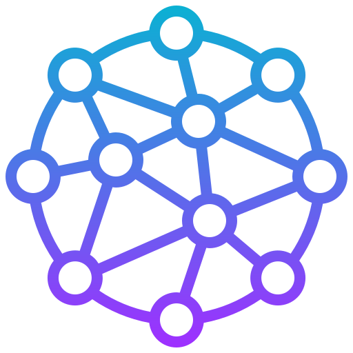

  <h1 align="center">NO-Q</h1>

  Multi-tenant SaaS helpdesk platform with AI-assisted ticket triage, customer workspaces, platform administration, and tenant-level customization.

 

  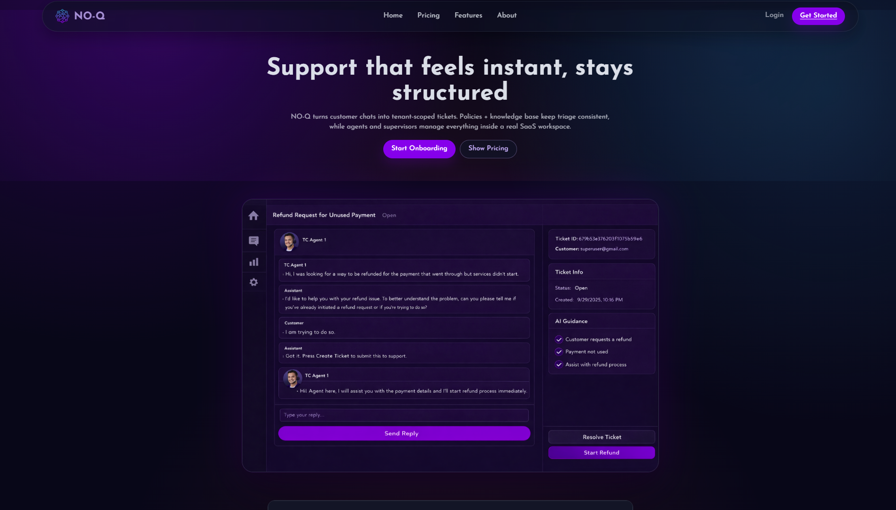

NO-Q transforms customer conversations into structured support tickets through AI-assisted workflows while giving organizations complete control over teams, branding, knowledge bases, analytics, and platform operations.

Built as a full-stack SaaS application with Flask, MongoDB, JWT authentication, and vanilla JavaScript.

 

## Architecture

Backend

- Flask
- MongoDB Atlas
- JWT Authentication
- Bcrypt Password Hashing
- Blueprint-Based Routing
- OpenAI/Groq Compatible AI Integration
- Multi-Tenant Data Isolation

Frontend

- HTML
- CSS
- Vanilla JavaScript
- Static Asset Delivery
- No Build Tools or Framework Dependencies

 

## Client Workspace

Organizations receive their own isolated workspace for managing support operations.

  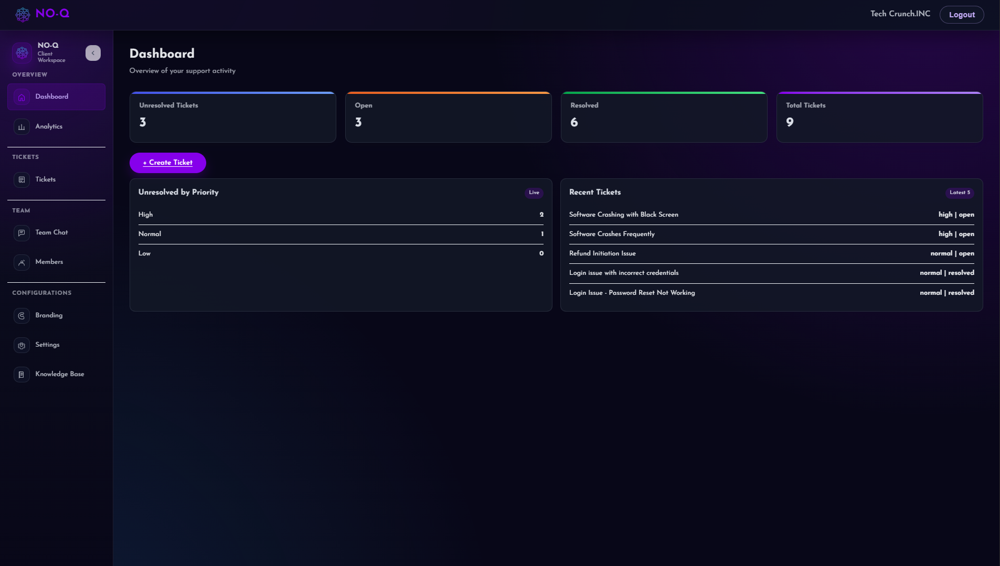

The dashboard provides ticket summaries, priority breakdowns, and real-time activity across the organization.

 

  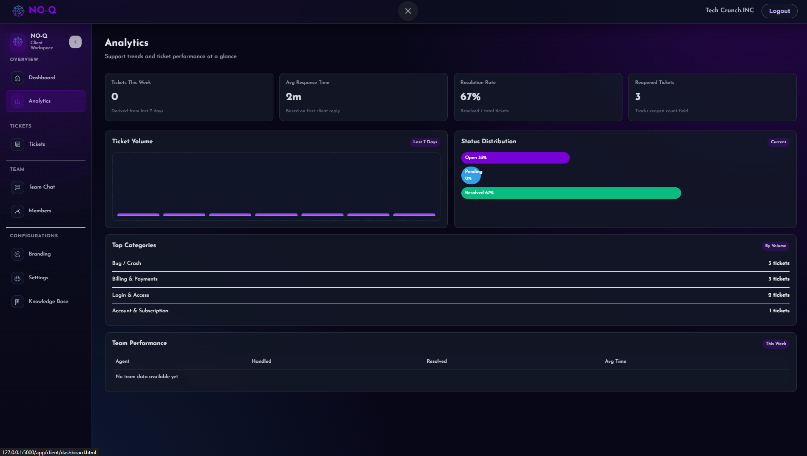

Analytics track ticket volume, response times, resolution rates, category trends, and overall team performance.

 

  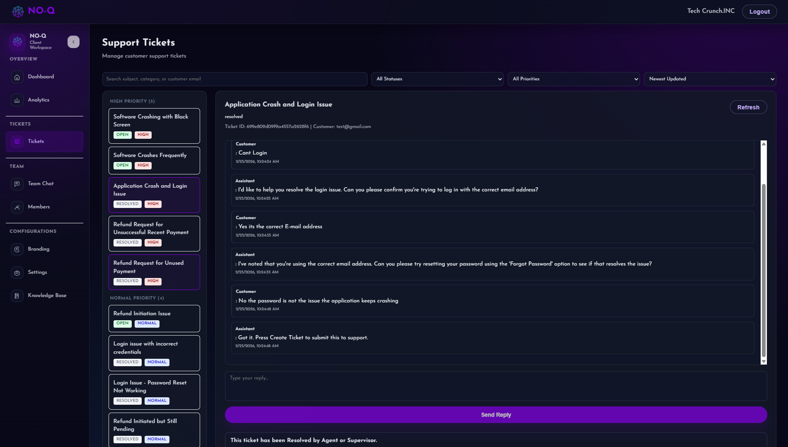

Agents and supervisors collaborate through threaded ticket conversations with AI-assisted responses and structured workflows.

 

  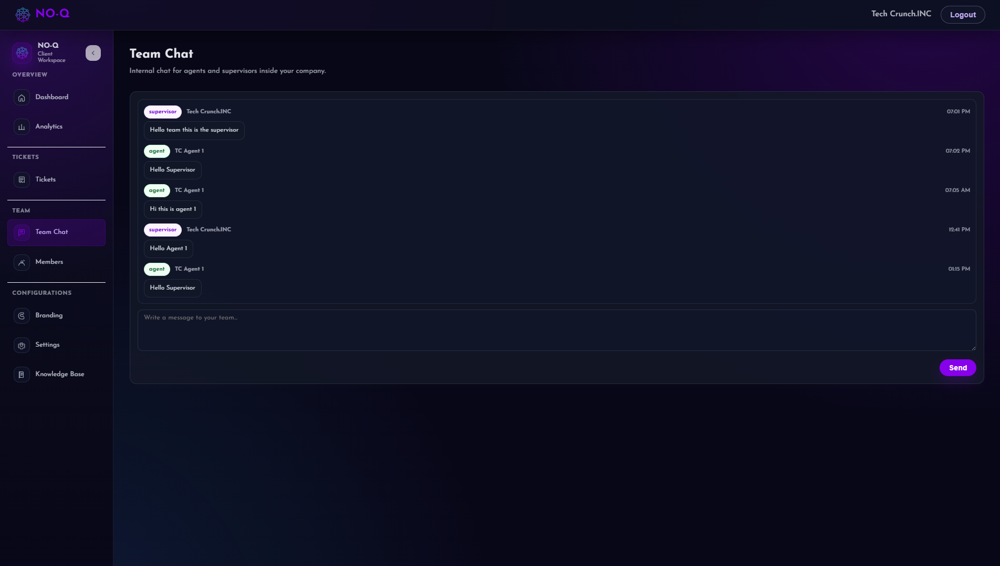

Internal team communication allows supervisors and agents to coordinate without leaving the platform.

 

  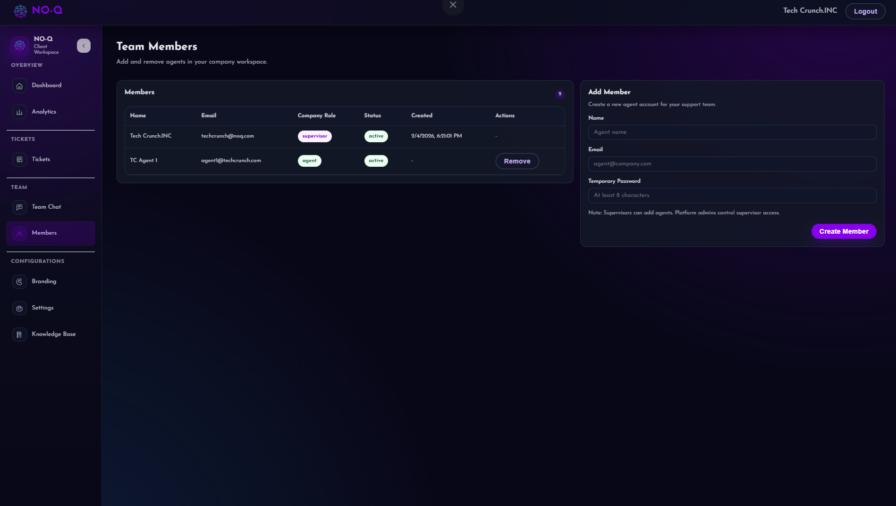

Supervisors can create and manage support agents within their company workspace.

 

  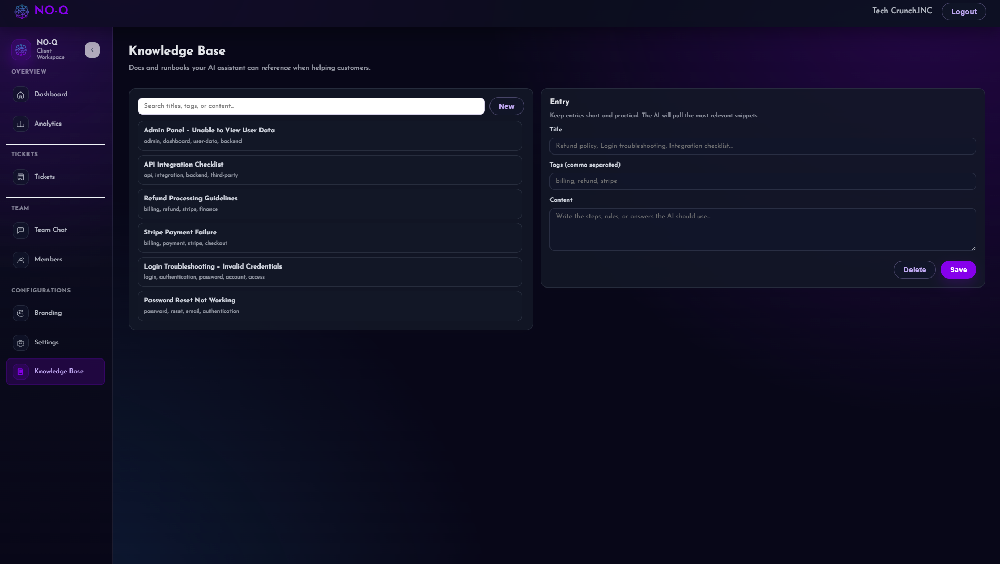

Each organization maintains a private knowledge base used for retrieval-augmented AI support assistance.

 

  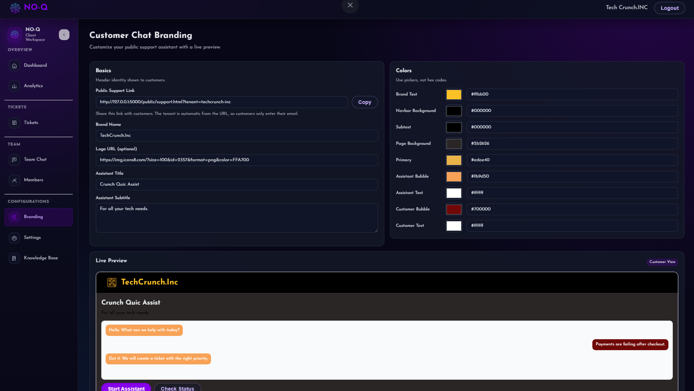

Client workspaces support custom branding, colors, logos, and assistant configuration with live previews.

 

## Customer Experience

Customers interact through branded public support portals.

  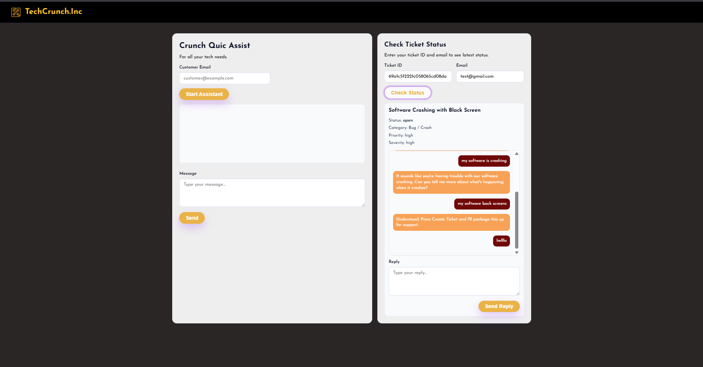

The system supports AI-guided conversations, ticket creation, live replies, and self-service ticket tracking.

 

## Platform Administration

Platform administrators manage tenants, billing, approvals, and operational health across the entire system.

  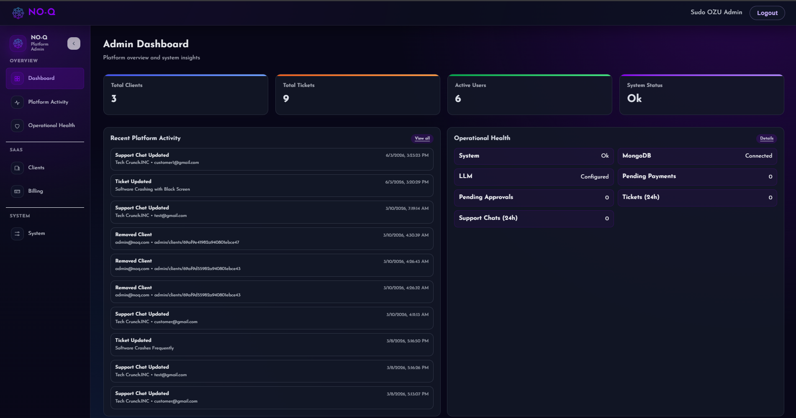

The administration dashboard provides visibility into platform activity and organization-wide metrics.

 

  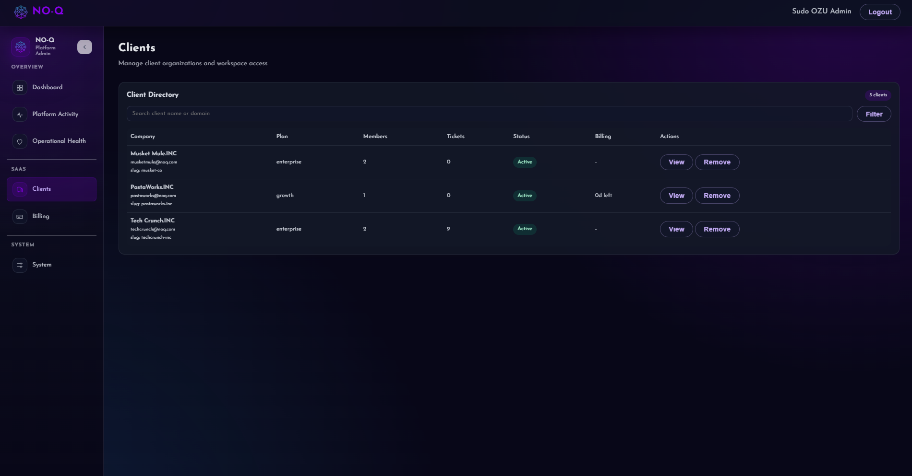

Client organizations can be approved, managed, or removed from a centralized interface.

 

  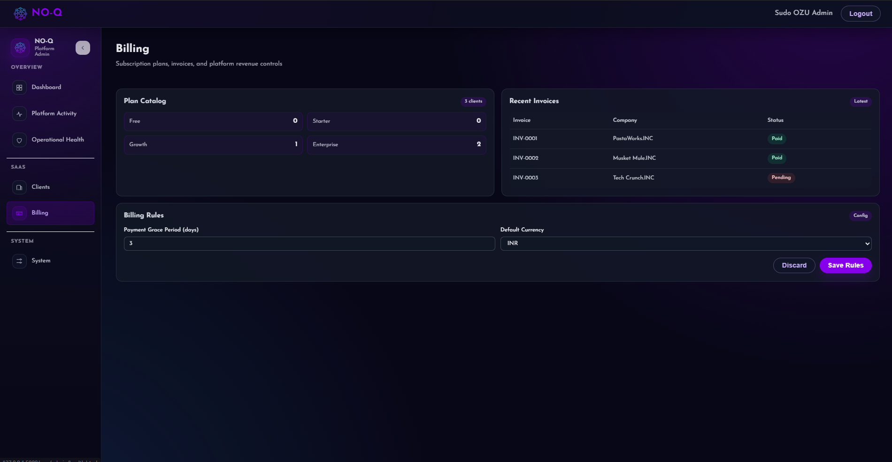

Subscription plans, invoices, payment rules, and revenue settings are handled at the platform level.

 

  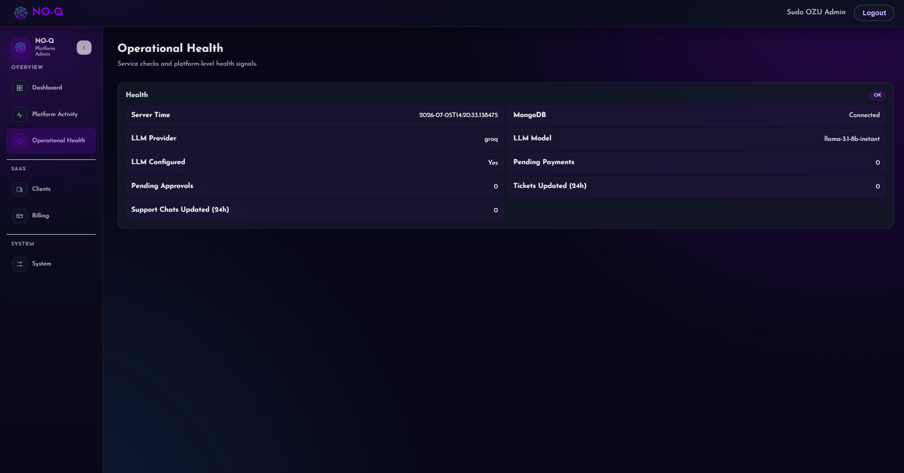

Operational health monitoring includes database connectivity, LLM providers, payment systems, and support activity.

 

  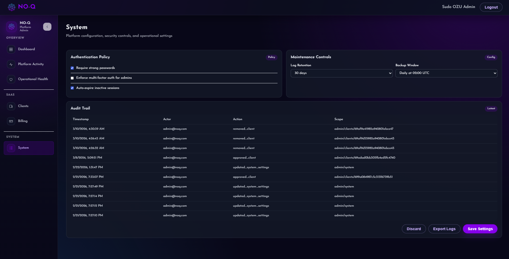

System configuration changes and administrative actions are tracked through a complete audit trail.

 

## Authentication

  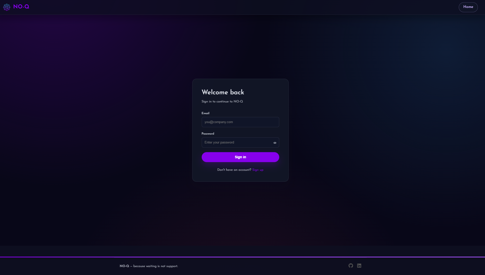

JWT-based authentication with role-based access control supports platform administrators, supervisors, and support agents.

 

## Core Features

- Multi-tenant SaaS architecture
- AI-assisted ticket triage
- Retrieval-augmented knowledge base
- Customer self-service portals
- Team chat and collaboration
- Supervisor and agent management
- Analytics and reporting
- Organization branding customization
- Platform billing administration
- Operational monitoring and audit logs
- JWT authentication and role-based permissions

 

## Technology Stack

Backend

- Python
- Flask
- MongoDB
- PyMongo
- JWT
- Bcrypt

Frontend

- HTML
- CSS
- JavaScript

Infrastructure

- MongoDB Atlas
- Groq
- OpenAI Compatible APIs